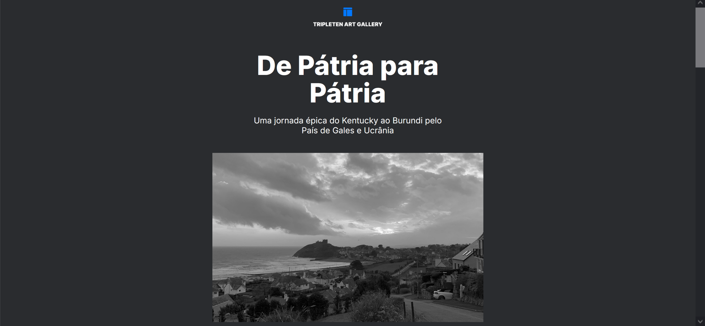

# Tripleten web_project_homeland

<h1 align="center">
  
Acessar <a href="https://borges-camila.github.io/web_project_homeland/">aqui</a>

  
  
  
  
  
  
</h1>
 
- Projeto desenvolvido com intuito de apresentar histórias e fotos de alguns profissionais que fazem parte da TripleTen.

## Tecnologias

- Projeto elaborado utilizando HTML e CSS, sendo este responsível aos tamanhos de tela mobile, tablet e desktop; 
- Utilizado display flex e grid.

## Como utilizar

- Você pode clonar o repositório
- Abrir o arquivo index.html

